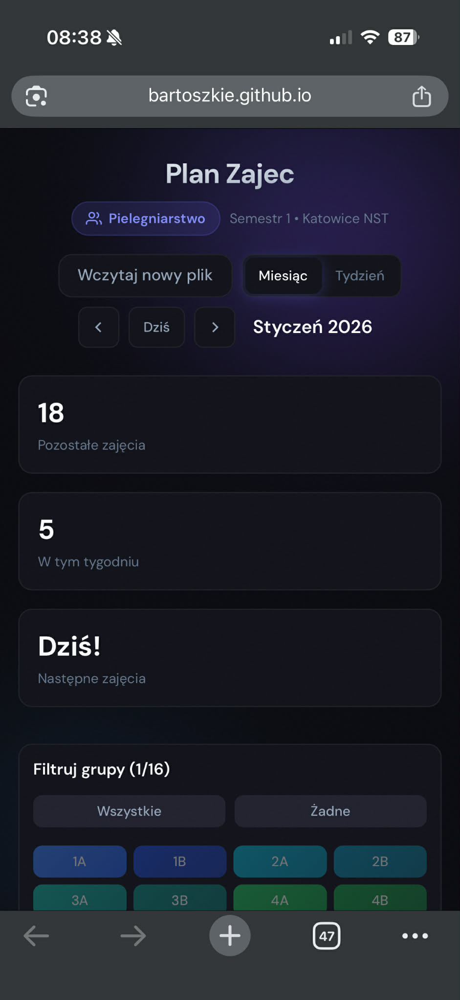
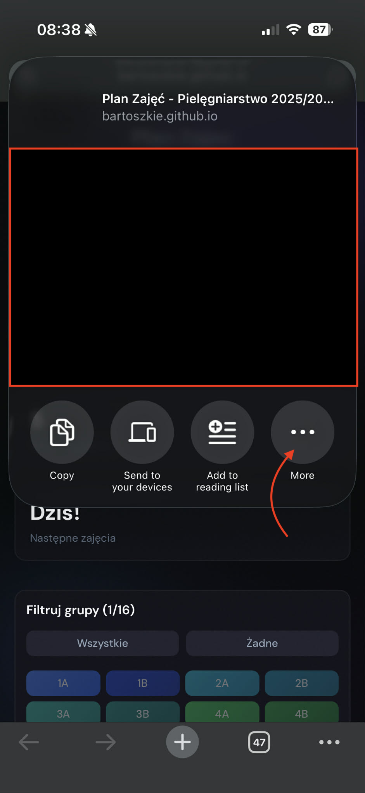
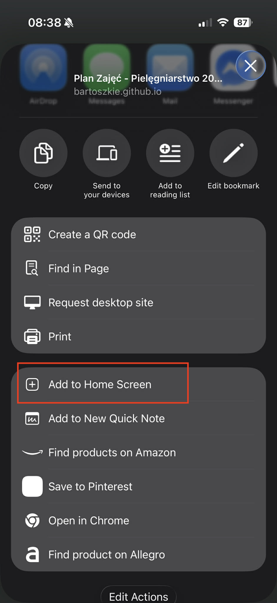
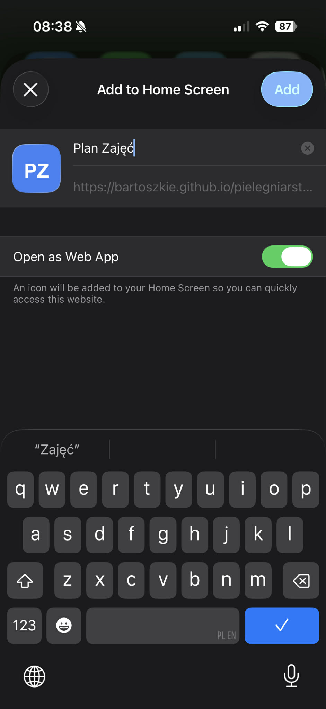

# Plan Zajęć Pielęgniarstwo

Aplikacja do przeglądania harmonogramu zajęć dla studentów pielęgniarstwa.

## Jak korzystać z aplikacji

### 3 proste kroki:

1. **Wczytaj plik Excel**
   - Kliknij przycisk "Wczytaj harmonogram" na górze strony
   - Wybierz plik Excel z harmonogramem zajęć
   - Poczekaj, aż plik zostanie przetworzony

2. **Wybierz grupy**
   - Po wczytaniu pliku wybierz interesujące Cię grupy z listy
   - Możesz wybrać jedną lub więcej grup
   - Zajęcia wybranych grup będą wyświetlane w kalendarzu

3. **Kliknij na dzień zajęć, aby zobaczyć szczegóły**
   - Kliknij na dowolny dzień w kalendarzu, aby zobaczyć szczegóły zajęć
   - W oknie modalnym zobaczysz godziny, przedmiot, prowadzącego i salę

## Instalacja aplikacji na ekranie głównym

### 🤖 iPhone (Safari)

1. Otwórz aplikację w przeglądarce Safari
2. Kliknij ikonę "Udostępnij" (kwadrat ze strzałką do góry) na dolnym pasku
3. Przewiń w dół i wybierz "Dodaj do ekranu początkowego"
4. Nadaj nazwę (np. "Plan Zajęć") i kliknij "Dodaj"
5. Aplikacja pojawi się na ekranie głównym jako ikona

### 🤖 iPhone (Chrome)

1. Otwórz aplikację w przeglądarce Chrome
2. Kliknij ikonę "Udostępnij" (kwadrat ze strzałką do góry) w pasku adresu strony
3. Przewiń w dół i wybierz "Dodaj do ekranu początkowego"
4. Nadaj nazwę (np. "Plan Zajęć") i kliknij "Dodaj"
5. Aplikacja pojawi się na ekranie głównym jako ikona

### 🤖 Android (Chrome)

1. Otwórz aplikację w przeglądarce Chrome
2. Kliknij ikonę menu (trzy kropki) w prawym górnym rogu
3. Wybierz "Dodaj do ekranu głównego" lub "Zainstaluj aplikację"
4. Nadaj nazwę (np. "Plan Zajęć") i kliknij "Dodaj"
5. Aplikacja pojawi się na ekranie głównym jako ikona

### Przykład Chrome na iPhone: 
1. Otwórz stronę w przeglądarce (najlepiej Chrome)

2. Kliknij ikonę "Udostępnij" (kwadrat ze strzałką do góry) w pasku adresu strony

3. Kliknij "Dodaj do ekranu początkowego"

4. Nadaj nazwę (np. "Plan Zajęć") i kliknij "Dodaj"

⚠️ **Uwagi:** 
- Jeśli nie wiesz jak to działa, kliknij w przycisk "Jak to działa?" na górze strony, aby zobaczyć instrukcje.
- Po dodaniu do ekranu głównego aplikacja będzie działać jak natywna aplikacja mobilna, bez paska adresu przeglądarki.
- Parsowanie pliku Excel odbywa się lokalnie na urządzeniu użytkownika, co zapewnia prywatność danych - nie trzeba się logować
- Jeśli masz przeczucie, że aplikacja, nie zczytała czegoś poprawnie, sprawdź w samym pliku Excel! Jest on defaultowo pełen błędów i któraś z jego wersji moze popsuć algorytm parsujący.
